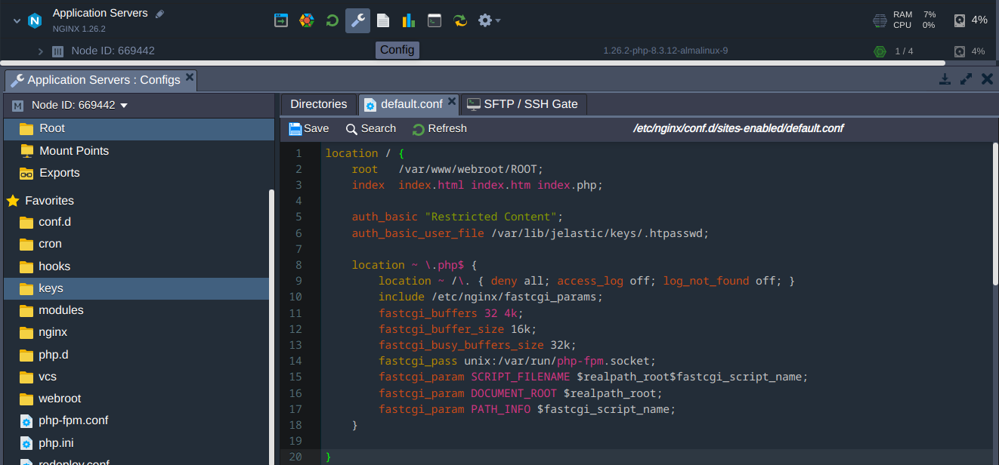

  

# NGINX Safe Reload Add-On

## Overview

The **NGINX Safe Reload** add-on allows you to apply configuration changes to your NGINX-based server within the Virtuozzo Application Platform seamlessly, without restarting the service. It performs a syntax check before reloading to ensure that all new configurations are error-free. This process minimizes downtime and prevents potential service interruptions caused by misconfigurations, allowing for safer and more efficient management of your web server.

## How Does the NGINX Safe Reload Add-On Work?

The NGINX Safe Reload add-on can be installed on any NGINX-based node, such as those commonly serving as Load Balancers or Application Servers. The configuration check is performed by executing `/usr/sbin/nginx -t`, which tests the syntax of the NGINX configuration files. If the syntax check passes, the add-on reloads the NGINX service with the new configuration by executing `/usr/sbin/nginx -s reload`. If the syntax check fails, the add-on outputs a warning message with the details of the syntax check. All commands are executed with the privileges required to test and reload the NGINX service.

Additionally, you can perform just a syntax check without reloading the NGINX service, in which case the add-on will output the result of the syntax check.

## Installation Process
Hover over your NGINX-based node layer in the Virtuozzo Application Platform interface and click on the **Add-Ons** button. 

In the opened dialog, click on the **Install** button.

In a moment, the add-on will be installed and ready to use.

Alternatively, you can install the add-on by navigating to the **Add-Ons** section in the **Marketplace** or by importing the appropriate manifest file.

## Usage

After the installation, the add-on gives you the options to:

* **Check Configs**: Perform a syntax check of the NGINX configuration files.
* **Reload**: Apply the configuration changes to the NGINX service.
* **Uninstall**: Remove the add-on from the node layer.

For example, you can navigate to the **Configs** section of the NGINX-based node layer, change an NGINX configuration file, and press **Save**. Then, go back to the **Add-Ons** section and click on the **Check Configs** or **Reload** button. The add-on will perform a syntax check or a syntax check and reload the NGINX service, respectively.

## License

This add-on is released under the Apache 2.0 license. For more information, see the [LICENSE](LICENSE) file.